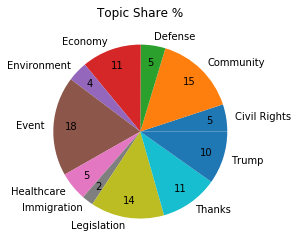
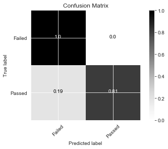

# language-in-politics
Analysis of US Congress 115 (2017-2018) using data on proposed Bills and tweets of Representatives.

Final slide results:
https://docs.google.com/presentation/d/1E63hIkQxyjhnA7tJmvYACG4AxeqHnZ-moJ6FOysOXuw/edit?usp=sharing

## Data Sources
* Bills:
  * Bill text information was taken from https://www.congress.gov
  * Bill vote information was taken from https://github.com/unitedstates/congress/wiki/votes
* Tweets:
  * Tweets were taken from https://dataverse.harvard.edu/dataset.xhtml?persistentId=doi:10.7910/DVN/UIVHQR

## EDA
The vast majority of bills proposed did not make it to a vote. ~11,000 were proposed that could be voted on by both chambers. ~500 bills made it to a vote of which the vast majority passed. The exploration highlights how most bills are failed along the path of creation and not necessarily at the final stage of voting.

### To-Do: Sentiment analysis statistical analysis
Sentiment analysis was performed using NLTK's Vader approach.

Topic modeling was conducted using Gensim's LDA model according to the steps and code provided by https://www.machinelearningplus.com/nlp/topic-modeling-gensim-python/ in order to determine the areas of discussion amongst the representatives. Based on the coherence score 25 topics were chosen and then manually binned into more general topic umbrellas with their representative words:
* **Civil Rights**: rt, woman, thank, work, pay, equal, man, housegop, support, timeright, rt, protect, vote, must, woman, fight, stand, today, internet
* **Community**: day, congrat, win, congratulation, go, today, team, great, game, nationalwork, help, community, support, program, business, local, today, center, thank, family, must, thought, prayer, victim, people, attack, stand, keep, community
* **Defense**: statement, read, full, trump, president, secretary, syria, war, realdonaldtrump, administration, stay, update, rt, israel, state, key, count, obama, important, safe
* **Economy**: job, news, energy, rt, create, economy, new, great, good, company, tax, american, cut, family, would, work, people, job, pay, worker
* **Environment**: make, need, sure, child, water, get, must, rt, kid, epa
* **Event**: office, student, school, today, visit, staff, info, tomorrow, hour, rtwatch, live, rt, tune, discuss, hear, join, hearing, today, talk, great, thank, today, meeting, meet, morning, discuss, visit, enjoy, talk
* **Healthcare**: health, care, aca, insurance, coverage, plan, healthcare, american, million, trumpcare. care, health, obamacare, access, veteran, repeal, act, affordable, quality, improve
* **Immigration**: policy, immigration, child, trade, family, border, trump, immigrant, rt, administration
* **Legislation**: rt, look, forward, legislation, bipartisan, introduce, act, proud, join, bill, rt, thank, rep, congressman, support, htt, repjayapal, say, join, roslehtinen, bill, house, pass, vote, senate, act, republican, congress, today, bipartisan
* **Thanks**: honor, today, service, thank, serve, veteran, day, woman, nation, country, happy, friend, birthday, family, wish, celebrate, day, year, love, everyone, year, award, honor, receive, today, ago, name, present, rt, congrat
* **Trump**: president, law, justice, sotu, trump, potus, must, hold, scotus, abuse, rt, world, america, get, word, build, well, make, deal, thing, rt, security, russia, trump, election, national, video, need, president, debt

The breakdown of each topics prominence in the corpus of tweets is shown in the image below: 

### Baseline Model
A first pass was made to determine whether it could be predicted if a bill would come to a vote. The features used in the baseline mode were:
* number of democratic cosponsors 
* number of republican cosponsors
* how many cosponsors withdrew
* the type of bill
* the committee the bill was referred to

Three baseline models were constructed using Sci-Kit Learn. To handle the problem of class-imbalance the training was done on synthetically oversampled data using SMOTE (Synthetic Minority Over-sampling Technique). F1 Score was chosen as an evaluation metric on the testing data which was not oversampled in order to balance overall accuracy and recall of the minority class.

| Model | F1 Score (Failed) | F1 Score (Passed) |
|---|:---:|:---:|
| Logistic Regression | .83 | .13 |
| Random Forest | .97 | .27 |
| SGD Classifier | .84 |  .13 |

The baseline models did moderately well in determining if a bill failed (the majority class) but had great difficulty in consistently and accurately predicting whether a bill passed (the minority class).

## Feature Engineering
To determine if the text of a bill is predictive of its resolution it is necessary to create a numerical representation of the unstructured data. To do this document embeddings were calculated using Spacy's built in word vectors from en_core_web_lg and aggregated over the entire document. 

The three types of models above were optimized using GridsearchCV with the added feature of the document embeddings.

| Model | F1 Score (Failed) | F1 Score (Passed) |
|---|:---:|:---:|
| Logistic Regression | .99 | .76 |
| Random Forest | .99 | .85 |
| SGD Classifier | .99 |  .83 |

Random Forest results:

The models with the document embeddings had significant improvements over the baseline models. They more accurately determine if a bill has failed but also manage to recall the minority class with greater consistency and accuracy. It is likely that the models have picked up on similarities in topic of bills that are most likely to pass (examples from exploring the actual text include voting on the place of celebration for the commemoration of Kamehameha I). Further exploration is necessary to highlight the models' effectiveness in determining the success of more substantive legislative bills. The use of document embeddings makes interpretation of specific feature importance challenging. Next steps include looking into topic modeling of the passed bills and determining commonalities in those that the models managed to identify.

### TO DO:
* Create similarity between representatives based on tweet embeddings for use in Louvain community detection
* Create similarity between representatives based on voting record
* Create similarity of above similarities
* Create custom word embeddings for tweets, repeat above and compare results
* Create custom word embeddings for bills and rerun baseline models to compare results
